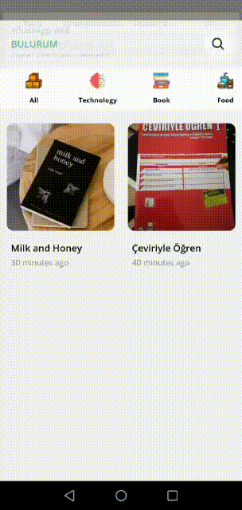
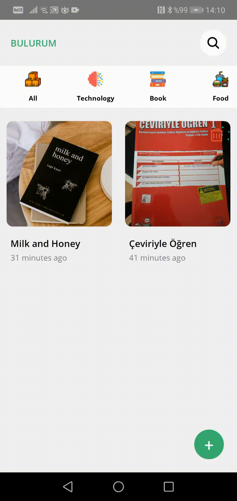
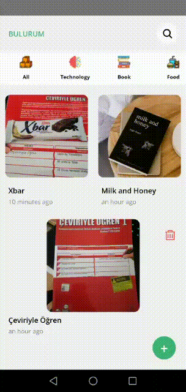

# Lowest Price - React Native

Bu proje Yönetim Bilişim Sistemleri (MIS) 4. sınıf güz dönemi vize projesi kapsamında
yapılmıştır. Proje ile ürün fiyat bilgisi sunan mobil uygulamanın geliştirilmesi
amaçlanmaktadır.

## Kullanılan Teknolojiler

**İstemci:** React Native

**Sunucu:** [Tıklayınız](https://github.com/ysnbyzli/lowest-price-api)

## Özellikler

- Üyelik Sistemi
- Profil fotoğrafı ekleme/kaldırma
- Şifre değiştirme
- Tanıtım Ekranları
- Ürün CRUD işlemleri
- Ürün adına veya barkoduna göre arama işlemleri
- Ürüne ait filtreleme işlemleri
- Ürüne ait fiyat kayıt listesi
- Kategoriye göre ürün filtreleme işlemleri
- Favorilere ekleme/kaldırma

## Ortam Değişkenleri

Bu projeyi çalıştırmak için aşağıdaki ortam değişkenlerini .env dosyanıza eklemeniz gerekecek

`API_URL`

## Ekran Görüntüleri







## Bilgisayarınızda Çalıştırın

Projeyi klonlayın

```bash
  git clone https://github.com/ysnbyzli/YBS-Mobile-Projects.git
```

Proje dizinine gidin

```bash
  cd my-project
```

Gerekli paketleri yükleyin

```bash
  npm install
```

Sunucuyu çalıştırın

```bash
  npm run start
```

## Lisans

[MIT](https://choosealicense.com/licenses/mit/)
